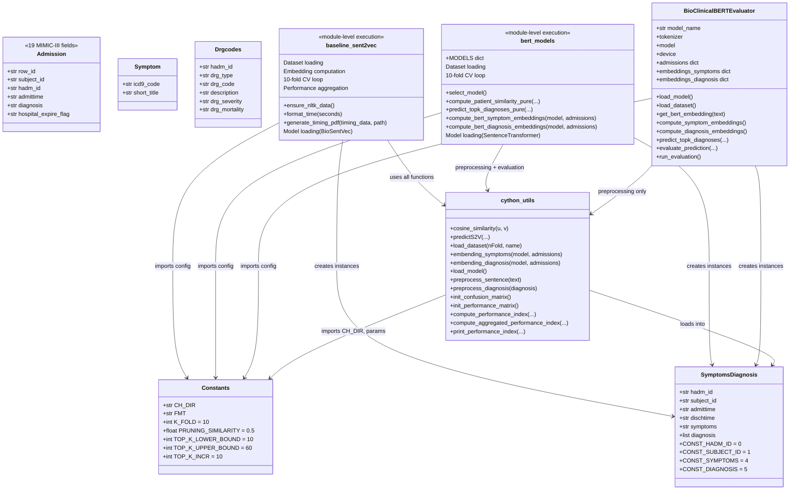

# System Design Visualization
# Generated: 2026-02-15
# THIS FILE IS FOR LOCAL REVIEW ONLY -- DO NOT COMMIT
# It is listed in .gitignore to prevent accidental commits.

## 1. System Overview

This project is a reproduction and enhancement of the paper "AI-Driven Clinical Decision
Support: Enhancing Disease Diagnosis Exploiting Patients Similarity" (Comito et al., 2022,
IEEE Access). It implements a patient similarity-based disease diagnosis prediction system
using NLP embeddings over MIMIC-III clinical data.

The system has TWO parallel pipelines:
1. **Baseline Pipeline** -- BioSentVec (Sent2Vec, 700D) sentence embeddings
2. **BERT Enhancement Pipeline** -- Clinical BERT models (768D) from HuggingFace

Both pipelines share identical preprocessing, evaluation metrics, data splits, and output
format, enabling direct comparison.

### Key Facts
- **Dataset**: 128 patient admissions from MIMIC-III (Symptoms-Diagnosis.txt)
- **Evaluation**: 10-fold cross-validation (~116 train / ~13 test per fold)
- **Prediction Strategies**: MAX similarity + TOP-K (K=10,20,30,40,50)
- **Similarity Thresholds**: 0.6, 0.7, 0.8, 0.9, 1.0
- **Metrics**: TP, FP, Precision, Recall, F-Score, Prediction Rate

---

## 2. High-Level System Architecture


---

## 3. Data Flow Diagram -- Baseline Pipeline


---

## 4. Data Flow Diagram -- BERT Pipeline


---

## 5. Component Relationship Diagram



---

## 6. Prediction Algorithm Sequence Diagram


---

## 7. Module Dependency Graph


---

## 8. Data Schema

### 8.1 Raw Data Format (Symptoms-Diagnosis.txt)
```
HADM_ID ; SUBJECT_ID ; ADMIT_TIME ; DISCHARGE_TIME ; SYMPTOMS ; DIAGNOSIS
142345  ; 10006      ; 2164-10-23 ; 2164-11-01     ; Sepsis,...| HCFA:SEPTICEMIA AGE >17
```
- **128 records** total
- Symptoms: comma-separated ICD-9 short titles
- Diagnosis: DRG type prefix (HCFA/APR/MS) + colon + description, separated by "--"

### 8.2 Fold Data Format (TrainingSet.txt / TestSet.txt)
```
HADM_ID_Symptom1,Symptom2,Symptom3,...
142345_Sepsis,React-oth vasc dev/graft,...
```
- Training: ~116 records per fold
- Test: ~13 records per fold

### 8.3 Output Format (PerformanceIndex.txt)
```
 FOLD 0: LEN train: 116, LEN test: 13
 0 - HADM_ID=124073: PERFORMANCE INDEX of MAX SIMILARITY by MAX
     TP    FP    P    R    FS    PR
 1.0  ...
 0.9  ...
 ...
 PERFORMANCE INDEX of TOP-10 SIMILARITY by MAX
 ...
 ****
 10-FOLD PERFORMANCE INDEX of MAX SIMILARITY by MAX
 [Aggregated means across all folds]
```

---

## 9. Key Architectural Decisions and Observations

### 9.1 Design Pattern: Module-Level Execution
Both `baseline_sent2vec.py` and `bert_models.py` execute their entire pipeline at **import
time**. The entry point scripts (`run_baseline.py`, `run_bert_analysis.py`) simply import
the module, which triggers execution. This is a direct port from the original single-file
`CS2V.py` script.

### 9.2 Shared Core via cython_utils
The `cython_utils.py` module is the shared backbone. Originally a compiled Cython `.c` file
(`util_cy.c` in the archive), it has been ported to pure Python. Both pipelines reuse:
- `preprocess_sentence()` and `preprocess_diagnosis()` for text normalization
- `load_dataset()` for fold loading
- `init_confusion_matrix()` and `init_performance_matrix()`
- `compute_performance_index()` and `compute_aggregated_performance_index()`
- `cosine_similarity()` for vector comparison
- `get_diagnosis_similarity_by_description_max()` for diagnosis evaluation

### 9.3 Embedding Compatibility Layer
BERT embeddings are wrapped in single-element arrays (`[embedding]`) to match the format
expected by `cython_utils.py` functions that index with `[0]`. This is a pragmatic
compatibility shim.

### 9.4 Two BERT Implementations
There are TWO BERT evaluation approaches:
1. **bert_models.py** (primary): Uses `SentenceTransformer` from sentence-transformers lib,
   pure Python prediction, reuses `util_cy` evaluation functions
2. **bert_eval.py** (alternative): Uses `AutoModel`/`AutoTokenizer` directly from
   transformers, has its own OOP evaluator class, standalone evaluation logic

### 9.5 No PRUNING_SIMILARITY in BERT Pipeline
The BERT pipeline's `predict_topk_diagnoses_pure()` does NOT apply the
`PRUNING_SIMILARITY=0.5` threshold during prediction (unlike the baseline's `predictS2V`).
This could lead to different behavior in edge cases.

### 9.6 Cython Legacy
The original system used a compiled Cython module (`util_cy.c` / `util_cy.pyd`). The
archive directory preserves the original C source. The current `cython_utils.py` is a
pure Python reimplementation that eliminated the Cython compilation requirement
(which had Python version compatibility issues with 3.10+).

### 9.7 Large Model Dependency
The baseline requires a 22.5 GB BioSentVec model file that must be manually downloaded.
BERT models are downloaded automatically from HuggingFace (~500MB each).

### 9.8 Academic Context
This is a Georgia Tech CSE 6250 (Big Data for Health Informatics) course project.
The `docs/Reproduce_w_transformers.md` document contains SLURM cluster deployment
scripts and a full IEEE-format report outline, indicating this is being developed
for academic submission.

---

## 10. Testing Architecture


---

## 11. Output and Reporting Pipeline


---

## 12. Deployment Architecture


