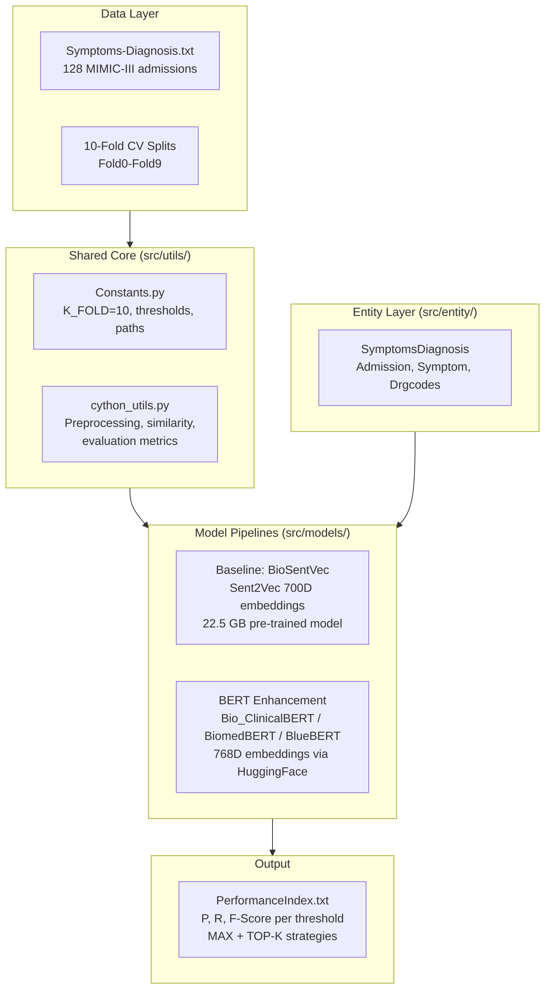

# Architecture Overview

AI-Driven Clinical Decision Support system for disease diagnosis prediction using patient
symptom similarity. Reproduces and enhances the work of Comito et al. (2022, IEEE Access).

> A detailed system design visualization is available locally in `.system-design-visualization`.
> Generate it by running the system-design-visualizer agent.

## High-Level Architecture

## Key Components

| Component | Location | Purpose |
|-----------|----------|---------|
| **Entity classes** | `src/entity/` | Data models for MIMIC-III records (SymptomsDiagnosis, Admission, Symptom, Drgcodes) |
| **Constants** | `src/utils/Constants.py` | Configuration: paths, K-fold count, similarity thresholds, Top-K bounds |
| **Cython Utils** | `src/utils/cython_utils.py` | Core algorithms: preprocessing, cosine similarity, prediction, evaluation metrics |
| **Baseline Model** | `src/models/baseline_sent2vec.py` | BioSentVec (Sent2Vec) 700D embedding pipeline with 10-fold CV |
| **BERT Models** | `src/models/bert_models.py` | Clinical BERT 768D embedding pipeline (3 model choices) with 10-fold CV |
| **BERT Evaluator** | `src/evaluation/bert_eval.py` | Alternative OOP evaluator using HuggingFace AutoModel directly |
| **Entry Scripts** | `scripts/` | `run_baseline.py`, `run_bert_analysis.py`, `verify_setup.py`, `analyze_performance.py` |
| **Tests** | `tests/` | Setup verification, BERT integration tests, reorganization validation |

## Tech Stack

- **Language**: Python 3.9+
- **Baseline NLP**: sent2vec, gensim, NLTK (stopwords, punkt)
- **BERT NLP**: sentence-transformers, transformers, PyTorch
- **Scientific**: numpy, scipy, scikit-learn
- **Visualization**: matplotlib (PDF timing and performance reports)
- **Data Source**: MIMIC-III v1.4 (PhysioNet)
- **Environment**: conda (environment.yml) or pip (requirements.txt / requirements_bert.txt)

## Data Flow

1. **Load** 128 patient admissions from `data/raw/Symptoms-Diagnosis.txt`
2. **Embed** symptoms and diagnoses using BioSentVec (baseline) or Clinical BERT
3. **Predict** diagnoses via cosine similarity: MAX match and TOP-K (K=10,20,30,40,50)
4. **Evaluate** at thresholds (0.6-1.0) using Precision, Recall, F-Score over 10-fold CV
5. **Report** aggregated metrics to `PerformanceIndex.txt` with timing reports

## Evaluation Protocol

Both pipelines share identical preprocessing (`preprocess_sentence`, `preprocess_diagnosis`),
data splits (pre-defined Fold0-Fold9), and evaluation functions. The only variable is the
embedding model, enabling fair comparison between 700D BioSentVec and 768D BERT embeddings.
