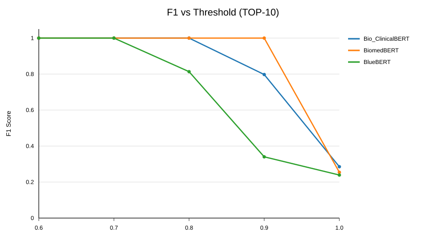
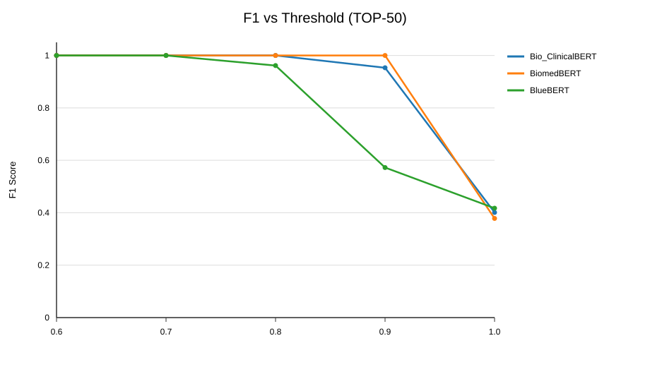
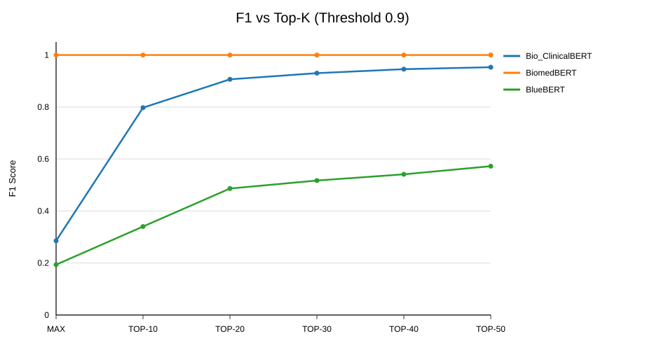
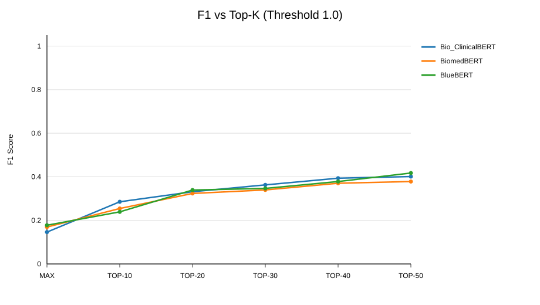
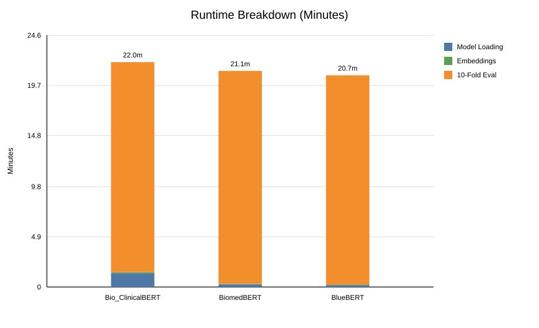
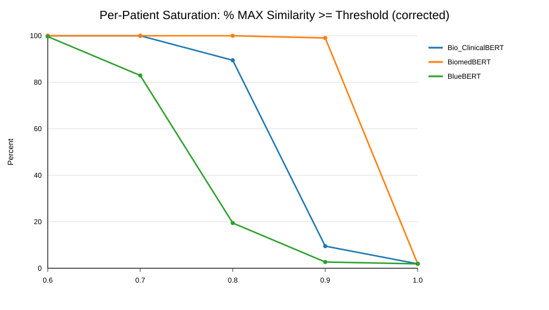
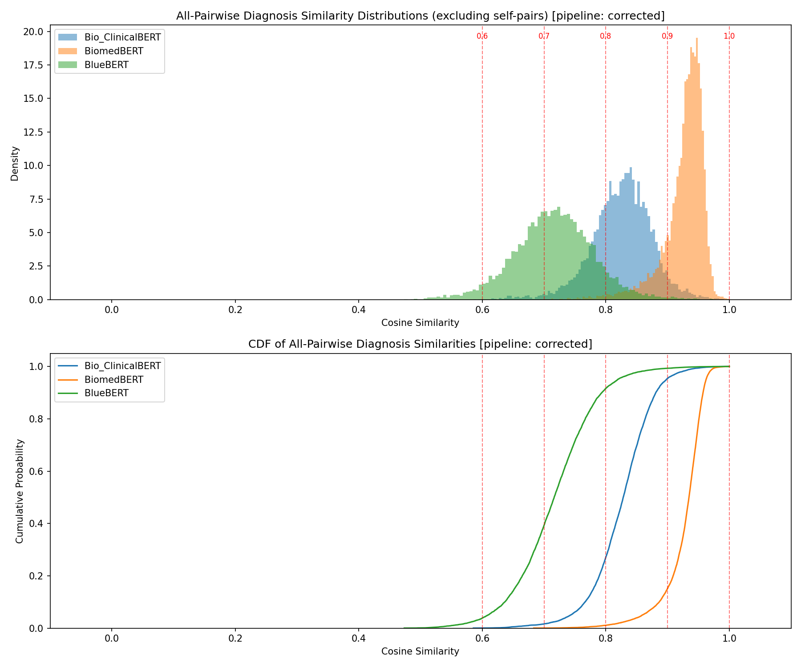
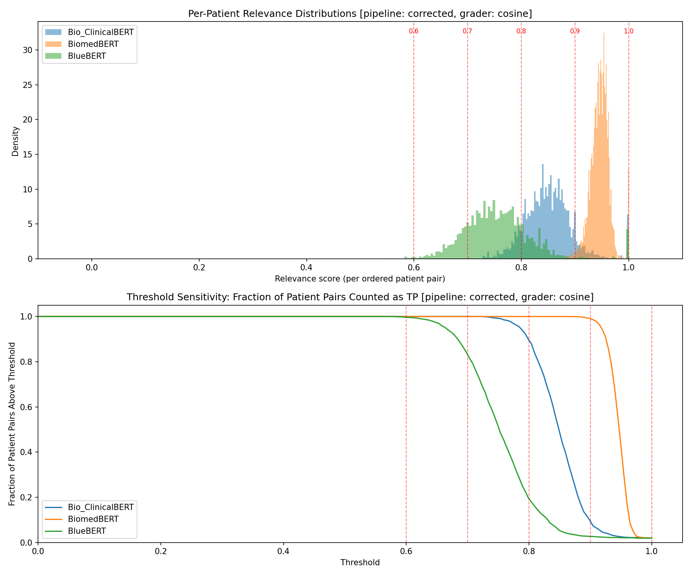

# AI-CDS Disease Diagnosis System

Clinical Decision Support System for disease diagnosis prediction using patient symptom similarity.

## Overview

This project reproduces and extends the clinical decision support system from *"AI-Driven Clinical Decision Support: Enhancing Disease Diagnosis Exploiting Patients Similarity"* (Comito et al., 2022). We first reproduce the original BioSentVec baseline, then replace it with three biomedical BERT models as an original extension. Our score distribution analysis reveals that the BERT evaluation metric saturates at the paper's threshold, making the F1 scores unsuitable for model comparison — this is the key finding and an open problem for future work.

> **Three caveats on every score below.**
>
> **1. The metric saturates.** At threshold 0.6 nearly every diagnosis pair counts as a match, so
> F1 = 1.000 measures the metric, not the model
> ([details](docs/findings/03-metric-saturation.md)).
>
> **2. The metric is degenerate — every BERT "F1" here is accuracy.** Across all 12,600 rows of
> committed BERT results, precision, recall, and F-score are the *same number*, because every test
> case increments exactly one of TP or FP. **Confirmed 2026-08-05:** this is a property of the
> embedding space, not the code. The baseline arm finally ran and its precision and recall *do*
> diverge, because it abstains on 30 of 129 cases (23.3%) when nothing clears the pruning gate.
> BERT's space is compact enough that it never abstains. Saturation and degeneracy are therefore
> **one root cause at two different gates** ([details](docs/findings/04-metric-degeneracy.md)).
>
> **3. The folds leak patients, by ~10× the effect under study.** Folds split on `HADM_ID`, but the
> 129 admissions come from only 100 patients — one holds 15. **41 of 129 test cases (31.8%)** have
> another admission from the same patient in their own retrieval pool. Inflation at threshold 1.0 is
> **+0.11 to +0.26**, against encoder differences of **0.015–0.046**. This affects **both arms**, so
> the published 0.489/0.512/0.521 carry it too ([details](docs/findings/05-patient-leakage.md)).
>
> Start at [docs/](docs/README.md); the synthesis is
> [07-comparison-validity.md](docs/findings/07-comparison-validity.md).

## Baseline Reproduction

The original paper uses **BioSentVec** (700-dimensional sent2vec embeddings trained on PubMed + MIMIC-III) to compute symptom-level pairwise cosine similarities between patients. Diagnosis similarity is determined by taking the MAX similarity across the Cartesian product of ground-truth and predicted diagnosis descriptions, then applying a threshold to classify true/false positives.

**Published results at threshold = 0.6** (Comito et al., not this repo's output):

| Method | F1 Score |
|--------|:--------:|
| TOP-10 | 0.489 |
| TOP-20 | 0.512 |
| TOP-30 | 0.521 |

**Our reproduction — 2026-08-05.** The baseline arm had never executed in this checkout: it crashed
on a wrong data path and an unbound name, and `sent2vec` cannot be built under MSVC, making the arm
Linux-only. Both were fixed and the arm ran end to end on a rented Linux box (10 folds, ~13 min):

| Method | Precision | Recall | **F1** | Published F1 |
|--------|:---------:|:------:|:------:|:------------:|
| TOP-10 @ 0.6 | 0.562 | 0.426 | **0.482** | 0.489 |

**Within 0.007 of the published figure** — the first successful reproduction of the paper's headline
number by this codebase. Note precision ≠ recall here, unlike every BERT row: the baseline declines
to predict on 23.2% of cases. Details: [09-baseline-first-run.md](docs/findings/09-baseline-first-run.md).

```bash
python scripts/run_baseline.py    # Linux only; needs the 20.93 GiB BioSentVec model
```

## BERT Extension (Original Contribution)

We replace BioSentVec with three biomedical BERT models that produce 768-dimensional embeddings:

| Model | HuggingFace Path | Training Data |
|-------|-------------------|---------------|
| Bio_ClinicalBERT | `emilyalsentzer/Bio_ClinicalBERT` | MIMIC-III clinical notes |
| BiomedBERT | `microsoft/BiomedNLP-BiomedBERT-base-uncased-abstract` | PubMed abstracts |
| BlueBERT | `bionlp/bluebert_pubmed_mimic_uncased_L-12_H-768_A-12` | PubMed + MIMIC-III |

**Results at threshold = 0.6 (baseline reference point):**

| Method | BioSentVec (Baseline) | Bio_ClinicalBERT | BiomedBERT | BlueBERT |
|--------|:---------------------:|:-----------------:|:----------:|:--------:|
| TOP-10 | 0.489 | 1.000 | 1.000 | 1.000 |
| TOP-20 | 0.512 | 1.000 | 1.000 | 1.000 |
| TOP-30 | 0.521 | 1.000 | 1.000 | 1.000 |

All three BERT models achieve perfect F1 = 1.000 at threshold 0.6. BiomedBERT maintains perfect scores through threshold 0.9. **However, these results are misleading** — see the score distribution analysis below.

### The comparison that is actually informative

Threshold 0.6 cannot distinguish the models because all three saturate there. **Threshold 1.0 is the
only setting where all four arms separate:**

| Method | Bio_ClinicalBERT | **BioSentVec** | BiomedBERT | BlueBERT |
|--------|:----------------:|:--------------:|:----------:|:--------:|
| TOP-10 @ 1.0 | 0.285 | **0.280** | 0.254 | 0.239 |
| `TP+FP` per fold | 12.9 | **9.9** | 12.9 | 12.9 |
| precision == recall? | yes | **no** | yes | yes |

Two things to read off this table.

**The baseline sits *inside* the BERT range, not below it.** The gap between the best transformer and
the 700D baseline is **0.005** — far smaller than the +0.11 to +0.26 leakage inflation and smaller
than the per-fold σ of 0.071–0.124. **No encoder ranking is supported by this experiment.** That is
the honest conclusion, and a more interesting one than a spurious win.

**The `TP+FP` column is the whole degeneracy finding at a glance.** Every BERT arm sums to exactly
12.9 — the mean fold test size — so `tp + fp == nrow`, precision collapses into recall, and the
"F1" is accuracy. The baseline sums to 9.9 because it abstains.

A four-arm comparison PDF is generated by `python scripts/compare_models.py` →
`results/model_comparison.pdf`.

### Runtime — the encoder is not the bottleneck

Measured across the three committed runs: **embedding is 0.17–0.45% of wall-clock**, while the
single-threaded pure-Python cosine loop is over 93%. Total fold time varies only **1.7%** across the
three transformers. Making embedding instantaneous would cut a 21.98-minute run to 21.88 minutes, so
**a GPU buys essentially nothing for these arms** ([details](docs/findings/08-runtime-and-cost.md)).

Results are also **platform-independent**: re-running Bio_ClinicalBERT on x86 Linux reproduced the
Apple-silicon numbers **bit-for-bit, to all 17 significant figures.**

```bash
python scripts/run_all_bert_models.py
```

See [docs/bert_model_comparison.md](docs/bert_model_comparison.md) for full results at all thresholds.

## Visual Summary (README Charts)

These plots are generated directly from the three experiment outputs in:
- `Prediction_Output_Bio_ClinicalBERT_15022026_11-33-48/PerformanceIndex.txt`
- `Prediction_Output_BiomedBERT_15022026_12-03-36/PerformanceIndex.txt`
- `Prediction_Output_BlueBERT_15022026_12-24-38/PerformanceIndex.txt`


*At TOP-10, BiomedBERT stays saturated through 0.9 while BlueBERT drops earlier.*


*At TOP-50, all models improve at strict thresholds, but separation remains at 0.9/1.0.*


*Top-K expansion strongly helps Bio_ClinicalBERT and BlueBERT at threshold 0.9.*


*At exact-match threshold 1.0, model differences are modest and increase gradually with K.*


*10-fold evaluation dominates runtime; startup overhead differs mostly by model loading time.*


*Per-patient MAX similarity saturation explains the perfect F1 at threshold 0.6.*

Regenerate these charts:

```bash
python3 scripts/build_readme_plots.py
```

## Score Distribution Analysis (Key Finding)

The perfect F1 scores are an artifact of **embedding space compactness** combined with the **MAX-over-Cartesian-product** evaluation strategy, not genuine diagnostic accuracy.

**Why the metric saturates:**

1. **Compact embedding spaces** — Biomedical BERT models map diagnosis text into a narrow region. Even *unrelated* diagnoses have high cosine similarity:

   | Model | Mean Pairwise Sim | Min Pairwise Sim | Std |
   |-------|:-----------------:|:----------------:|:---:|
   | BiomedBERT | 0.93 | 0.72 | 0.03 |
   | Bio_ClinicalBERT | 0.83 | 0.65 | 0.05 |
   | BlueBERT | 0.72 | 0.48 | 0.07 |

2. **MAX operator amplification** — Taking the maximum similarity across all diagnosis pairs inflates scores further. Per-patient MAX similarity exceeds 0.6 for virtually all patient pairs:

   | Model | % of patient pairs with MAX >= 0.6 |
   |-------|:----------------------------------:|
   | Bio_ClinicalBERT | 100.00% |
   | BiomedBERT | 100.00% |
   | BlueBERT | 99.96% |

3. **Conclusion** — The evaluation metric is saturated at threshold 0.6 for BERT models. The F1 scores cannot discriminate between models or meaningfully compare against the baseline. Alternative evaluation strategies (MEAN instead of MAX, DRG code matching, higher thresholds) are needed.

Visualizations and full statistics are in [`docs/score_distribution_analysis/`](docs/score_distribution_analysis/).

### Visualizations


*Diagnosis score distributions across baseline and BERT models.*


*Per-patient MAX similarity distributions showing saturation behavior.*

```bash
python scripts/analyze_score_distributions.py
```

## Project Structure

```
src/                     # Source code
  models/                # Baseline (sent2vec) and BERT implementations
  entity/                # Data classes (Admission, Symptom, Drgcodes)
  utils/                 # Utilities, constants, cython similarity
  evaluation/            # Evaluation modules
scripts/                 # Entry point scripts
  run_baseline.py        # Run BioSentVec baseline
  run_all_bert_models.py # Run all 3 BERT models sequentially
  analyze_score_distributions.py  # Score distribution analysis
data/                    # Data files
  folds/                 # 10-fold cross-validation splits
  raw/                   # Raw data files
  models/                # Pre-trained model files
docs/                    # Documentation and analysis reports
config/                  # Environment and requirements files
tests/                   # Test files
```

## Setup

**Conda environment:**

```bash
conda env create -f config/environment.yml
conda activate disease-diagnosis
```

**Key dependencies:** sentence-transformers, torch, matplotlib, numpy

**For baseline only:** Also requires sent2vec and the BioSentVec pre-trained model (~21 GB). See [docs/guides/setup.md](docs/guides/setup.md) for details. Note the baseline arm does not currently run — see [docs/findings/01-baseline-reproduction.md](docs/findings/01-baseline-reproduction.md).

## Citation

```bibtex
@article{comito2022ai,
  title={AI-Driven Clinical Decision Support: Enhancing Disease Diagnosis Exploiting Patients Similarity},
  author={Comito, Carmela and Falcone, Deborah and Forestiero, Agostino},
  journal={IEEE Access},
  volume={10},
  pages={6224--6234},
  year={2022},
  publisher={IEEE}
}
```
