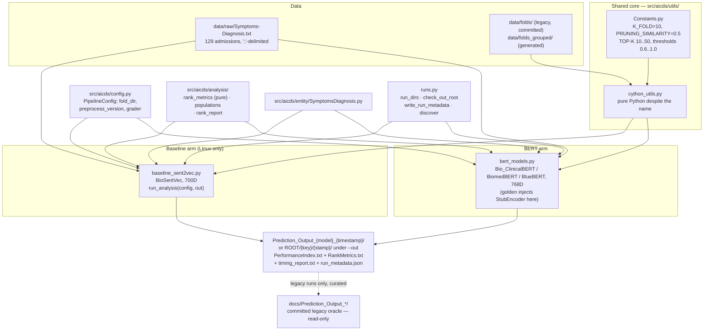

# Architecture

This supersedes the now-archived [`ARCHITECTURE.md`](../../archive/stale-docs/ARCHITECTURE.md).
Everything below was re-checked against the code on **2026-08-11** (the previous revision,
2026-08-08, predated the C1–C8 refactor batch: the deletion of `bert_eval.py` and the orphaned
entity modules, `aicds/runs.py` as the single run contract, the single `PerformanceIndex` parser,
and `run_metadata.json` — all of which changed this document).

**The three-sentence version:** Two model arms — the BioSentVec baseline and three BERT
variants — share a single pure-Python evaluation core (`src/aicds/utils/cython_utils.py`) so
that the embedding model is the only variable between them. Every run selects a
`PipelineConfig` (`legacy` by default, which reproduces the published pipeline bit-for-bit;
`corrected` and `drg` apply the fixes documented in `docs/findings/`), and both arms now run
end-to-end — the BERT arm anywhere, the baseline on Linux only. The committed results under
`docs/` are the read-only regression oracle, and a byte-exact golden test
(`pytest -m golden`) is what keeps refactoring from silently moving the numbers.

## Layered structure

| Layer | Location | What it actually does | Status |
|---|---|---|---|
| Data | `data/raw/Symptoms-Diagnosis.txt` | 129 MIMIC-III admissions, `;`-delimited, one per line | static, committed |
| Data | `data/folds/Fold0..Fold9/{TrainingSet,TestSet}.txt` | Pre-computed 10-fold CV split (splits on admission — the leaky split, kept for `legacy`) | static, committed — **never regenerate**; the golden depends on it |
| Data | `data/folds_grouped/` | `GroupKFold` on `SUBJECT_ID` — the leakage-free split | **generated** by `scripts/make_folds.py`, gitignored |
| Config | `src/aicds/config.py` | `PipelineConfig` — the seam every correctness fix lands behind: `fold_dir`, `preprocess_version`, `grader`, with legacy-preserving defaults. Named configs `LEGACY`/`CORRECTED`/`FOLDS_ONLY`/`PREPROCESS_ONLY`/`GRADER_DRG` | live; `require_supported_grader` makes an unread config field a loud error |
| Config | `src/aicds/utils/Constants.py` | Fold count, pruning floor, TOP-K bounds, path autodetection | live, imported by everything |
| Shared core | `src/aicds/utils/cython_utils.py` | Preprocessing, cosine similarity, prediction (`predictS2V`), evaluation math | live, imported by both arms — **pure Python**, see below |
| Analysis | `src/aicds/analysis/{rank_metrics,populations,rank_report}.py` | Rank-aware metrics (MRR, Hit@K, P@K, nDCG), the three abstention populations, and the `RankMetrics.txt` writer | live; `rank_metrics.py` is deliberately pure — no I/O, no config |
| Entities | `src/aicds/entity/SymptomsDiagnosis.py` | The one record type actually used: HADM_ID, symptoms, preprocessed diagnosis list | live |
| Run contract | `src/aicds/runs.py` | Where an arm writes (`run_dirs`, `check_out_root`, `write_run_metadata`) and how a reader finds it (`discover`, `Run`) | live since `9d08c94`/`7927a88`/`5a52d26`; **the one place run-directory shape is decided** |
| Model arm | `src/aicds/models/baseline_sent2vec.py` | BioSentVec (sent2vec) 700D embeddings, 10-fold CV | **runs since `c2fee6e`, Linux only**; `run_analysis(encoder, config, out)` behind a `__main__` guard since `9c9e251` |
| Model arm | `src/aicds/models/bert_models.py` | Bio_ClinicalBERT / BiomedBERT / BlueBERT (sentence-transformers) 768D | live; produced the committed results |
| Scripts | `scripts/run_baseline.py`, `run_bert_analysis.py`, `make_folds.py` | CLI entry points; both run scripts take `--pipeline` and `--out` | live |
| Scripts | `scripts/analyze_performance.py`, `analyze_score_distributions.py`, `analyze_rank_metrics.py`, `build_dashboard_data.py`, `build_readme_plots.py`, `compare_models.py` | Post-hoc parsing/plotting | live — all discovery goes through `runs.discover` and all parsing through `analysis/performance_index.py`; the four private parsers and six-to-seven private rules are gone |
| Output | `Prediction_Output_{model}_{timestamp}/` (or `ROOT/{key}/{stamp}/` under `--out`) — `PerformanceIndex.txt`, `RankMetrics.txt`, `timing_report.txt`, `run_metadata.json` | Per-admission, per-fold, and 10-fold-mean metric rows, plus provenance | curated legacy copies committed at `docs/Prediction_Output_*/`; all fresh runs land in gitignored `results*/` |
| Safety net | `tests/` — 413 fast tests + `tests/golden/stub768/PerformanceIndex.txt` | Characterization tests plus a byte-exact 10-fold golden using a sha256-seeded `StubEncoder` | live; `pytest -m golden` ≈ 43–53 min |

## The central design constraint: one evaluation core, two embedding arms

The entire point of the reproduction is that BioSentVec and the three BERT models are compared
under identical conditions, with the embedding model as the only thing that changes. That
constraint lives in `cython_utils.py`, which both `baseline_sent2vec.py` and `bert_models.py`
import for:

- `preprocess_sentence()` / `preprocess_diagnosis()` — text normalization for both arms
- `load_dataset()` — reads the static fold files
- `cosine_similarity()`, `get_diagnosis_similarity_by_description_max()` — the similarity math
- `init_confusion_matrix()`, `compute_performance_index()`,
  `compute_aggregated_performance_index()`, `print_performance_index()` — metric bookkeeping

What is *not* shared: the actual candidate-ranking loop. The baseline arm calls
`util_cy.predictS2V()` directly. `bert_models.py` does not — it defines its own
`compute_patient_similarity_pairwise()` and `predict_topk_diagnoses_pure()`, written to mirror
the baseline's loop line-for-line. So the two arms' prediction loops are two independent
implementations of the same algorithm — a place the ranking logic could silently drift, and
the reason the roadmap forbids "merging" them casually (`bert_models.py` also keeps a private
copy of `containGreaterOrEqualsValue` that no test exercises — see finding 12's defect list).

Whether the constraint actually held is pipeline-dependent, and this is the single most
important thing to know before comparing arms: **under `legacy` the two arms preprocess
diagnosis text differently (119/145 descriptions differ), so a legacy cross-arm delta is
confounded; under `corrected`/`drg` they match 145/145**
([06-preprocessing-defects](../findings/06-preprocessing-defects.md); how much of the corrected
pipeline's score drop the text-handling changes account for — this unification among them — is
measured per arm in [15](../findings/15-leakage-preprocessing-attribution.md): less than the fold
regrouping in every arm, and with a sign that varies by arm).

A few other things about this module that its name and the old docs get wrong or omit:

- **It is pure Python, not Cython.** The original compiled version (`util_cy.pyx` → `util_cy.c`
  via Cython 0.29.24) is archived at
  [`archive/cython_source/util_cy.c`](../../archive/cython_source/util_cy.c). There is no build
  step — it's a `.py` file with a name left over from the port.
- **`sent2vec` is no longer imported at module scope** — as of `c8e4ffd` it is imported inside
  `load_model()`, its only consumer, so the BERT arm imports `cython_utils` with base
  dependencies alone and the `pyproject.toml` split between the `bert` and `baseline` extras is
  finally honest. (`tests/test_bert_symptom_pairwise.py` still AST-loads functions as a relic
  of the old module-scope import; new tests should import normally.)
- **`stop_words` is now defined where it is read** (`5ae01a0`) — the old
  `NameError`-unless-monkeypatched behaviour is gone. Eleven historical monkeypatch sites
  remain (7 in tests, 4 in non-test code) and are Phase 2 cleanup, but they are now redundant
  rather than load-bearing.
- **Embedding dictionaries are keyed by preprocessed text, not `HADM_ID`**, one vector per
  unique symptom/diagnosis *string*, each wrapped in a one-element list so every call site can
  index `emb[0]`. The baseline stores whatever indexable structure `sent2vec` returns; the
  BERT arm wraps each flat vector in a list purely to honour the same `[0]` contract.
  Diverging from this silently changes results rather than raising.
- **Folds are static files, not computed at runtime.** `load_dataset(nFold, name)` just opens
  the fold file — no `train_test_split` or `KFold` call exists in the live path. Which fold
  *directory* it opens comes from the `PipelineConfig`. One sharp edge: `load_dataset` drops
  each line's final character, assuming a trailing newline — a hand-written fold file without
  one silently loses its last symptom (pinned by `tests/test_characterize_dataset.py`).

## Data flow, end to end

1. **Select a pipeline.** `--pipeline legacy|corrected|folds-only|preprocess-only|drg`, on
   **both** run scripts since `9c9e251`; `$AICDS_PIPELINE` still works and is what
   `python -m aicds.models.baseline_sent2vec` reads. `legacy` is the default everywhere and
   reproduces the published pipeline bit-for-bit.
2. **Load admissions.** Read `Symptoms-Diagnosis.txt`, split each line on `;` into
   `SymptomsDiagnosis` objects, preprocess the diagnosis field at load time
   (`preprocess_diagnosis`: lowercase, split multi-DRG lines on `--`, strip
   `apr:`/`hcfa:`/`ms:` prefixes, dedupe, re-attach the surviving prefix set).
3. **Load the embedding model.** `sent2vec.Sent2vecModel().load_model(...)` for the baseline,
   `SentenceTransformer(model_path)` for a BERT checkpoint — or an injected `encoder=` (this is
   how the golden test swaps in the deterministic `StubEncoder`).
4. **Embed.** Build the symptom and diagnosis embedding dicts in one pass over all 129
   admissions, before any fold loop starts. Under `corrected`/`drg` both arms preprocess the
   diagnosis text before encoding; the dict keys stay raw either way.
5. **For each of the 10 folds** (from `data/folds/` or `data/folds_grouped/` per the config):
   - For every test admission, score every training admission: for each test symptom take the
     max cosine against any train symptom, then average those maxima over
     `max(len(test_symptoms), len(train_symptoms))`.
   - **MAX strategy:** the single highest scorer above `PRUNING_SIMILARITY` (0.5). If none
     clears it, the case abstains — it contributes to neither TP nor FP.
   - **TOP-K strategy** (K = 10…50): rank candidates above the same floor, slice to K.
   - Grade each prediction. Under cosine grading:
     `get_diagnosis_similarity_by_description_max()` takes the MAX cosine over the Cartesian
     product of {true diagnoses} × {predicted diagnoses}, compared against the five thresholds.
     **Under `grader="drg-exact"`:** relevance is an exact DRG description match — no cosine,
     and the five threshold rows collapse to one value
     ([12](../findings/12-drg-grader.md)).
   - Accumulate TP/FP per threshold; accumulate per-case ranks for the rank metrics.
6. **Aggregate across folds.** `print_performance_index()` divides the 10 folds' sums by
   `K_FOLD` — a mean of 10 per-fold numbers, not a micro-average, which is why "10-fold TP"
   reads `12.9` (= 129/10) in the committed output.
7. **Write output.** `PerformanceIndex.txt` (untouched legacy format — the golden's subject),
   `RankMetrics.txt` (additive sibling: MRR/Hit@K/P@K/nDCG on three abstention populations),
   `timing_report.txt`, and `run_metadata.json` (written last — its presence means the run
   reached the end). With no `--out` these go into a timestamped directory under the current
   working directory, the layout the golden pins; `--out ROOT` writes `ROOT/{key}/{stamp}/`
   directly, which is the `results*/` layout the comparison scripts read.



## Constants (`src/aicds/utils/Constants.py`)

| Name | Value | Meaning |
|---|---|---|
| `K_FOLD` | 10 | Number of CV folds |
| `PRUNING_SIMILARITY` | 0.5 | Minimum symptom-level patient similarity for a candidate to be considered at all — this floor is also the abstention mechanism |
| `MIN_SIMILARITY` | 0 | Floor used to initialize max-tracking loops |
| `TOP_K_LOWER_BOUND` | 10 | First TOP-K strategy evaluated |
| `TOP_K_UPPER_BOUND` | 60 | Exclusive bound — with the increment, K = 10, 20, 30, 40, 50 |
| `TOP_K_INCR` | 10 | Step between TOP-K strategies |
| classification thresholds | `{1.0, 0.9, 0.8, 0.7, 0.6}` | Not a `Constants.py` name — a literal `set` duplicated at **7 sites, all inside `cython_utils.py`** (`:267`, `:296`, `:644`, `:653`, `:668`, `:696`, `:734`; recounted 2026-08-11 — the old figure of 8 counted `bert_eval.py`, now deleted), whose *iteration order* determines the **baseline** arm's output row order. The **BERT** arm gets that order from an ordered list instead: `bert_models.py:511` is `THRESHOLDS = [0.9, 1.0, 0.6, 0.8, 0.7]  # Same order as baseline`, consumed at `:647`, `:662` and `:677`, each of which writes a `PerformanceIndex.txt` row — so that literal *does* set row order, kept in sync with the set by nothing but its trailing comment. Seven further sites spell the same values as an ascending ordered **list** and none of those sets row order: `bert_models.py:638` (debug print), `analysis/performance_index.py:111`, and the reader-side `THRESHOLDS` constants in `analyze_performance.py`, `analyze_score_distributions.py`, `build_dashboard_data.py`, `build_readme_plots.py`, `compare_models.py` (8 ordered-list sites in non-test code in total) |
| `TRAIN` / `TEST` | `TrainingSet.txt` / `TestSet.txt` | Filenames within each fold directory |
| `CH_DIR` | four `.parent`s up from the file | Auto-detected repo root — an off-by-one here silently repoints every data path rather than raising |

Note the thresholds are iterated as a Python `set`, so every block in `PerformanceIndex.txt`
reports them in the fixed-but-non-numeric order `0.9, 1.0, 0.6, 0.8, 0.7` — CPython's hash
order for that literal, not a meaningful ordering. The formatting is load-bearing for the
golden: aggregate rows print threshold `1` (int) while per-case rows print `1.0`, which is why
the golden comparison is deliberately byte-exact rather than float-tolerant.

## Output format and the P = R = F1 collapse

`PerformanceIndex.txt` is plain text: a `FOLD N: LEN train: X, LEN test: Y` header, then for
each test admission six blocks (`MAX`, `TOP-10` … `TOP-50`), each a `TP FP P R FS PR` header
followed by one row per threshold. After all 10 folds, the same structure repeats aggregated
per fold and as the final `10-FOLD PERFORMANCE INDEX` mean. Example, from
[`docs/Prediction_Output_Bio_ClinicalBERT_15022026_11-33-48/PerformanceIndex.txt`](../Prediction_Output_Bio_ClinicalBERT_15022026_11-33-48/PerformanceIndex.txt):

```
10-FOLD PERFORMANCE INDEX of MAX SIMILARITY by MAX
	 TP 	 FP 	  P 	 R 	 FS 	 PR
0.9	3.7	9.2	0.2852564102564103	0.2852564102564103	0.2852564102564103	1.0
1	1.9	11.0	0.14615384615384616	0.14615384615384616	0.14615384615384616	1.0
0.6	12.9	0.0	1.0	1.0	1.0	1.0
```

`12.9` is `129 / 10` — the confirmation that the dataset is 129 admissions, not 128.

Across all three committed BERT result files (12,600 metric rows), `P == R == F` exactly and
`PR` is `1.0` in every aggregate row. The mechanism (from `compute_performance_index()`):

```python
precision = tp / (tp + fp)
recall = tp / nrow
f_score = (2 * recall * precision) / (recall + precision)
prediction_rate = (tp + fp) / nrow
```

Every test case with at least one qualifying candidate increments exactly one of TP or FP, so
`tp + fp == nrow` whenever nothing abstains — which is what `PR == 1.0` means — and then
precision and recall are algebraically the same number, and the F-score collapses onto them.
**The full story is in the findings**: for the BERT arms the number is accuracy
([04](../findings/04-metric-degeneracy.md)); the baseline abstains on ~23% of cases so its
P ≠ R ([09](../findings/09-baseline-first-run.md)); and the three columns' true names are
answered-hit-rate, all-cases-hit-rate, and coverage
([13](../findings/13-rank-aware-metrics.md)) — which is exactly why `RankMetrics.txt` reports
three labelled populations instead of inventing a new shape. What the answered population's
self-selection is worth is measured in [16](../findings/16-self-selection.md), from the per-case
`RankCases.txt` sibling P40 added.

## Known defects (current as of 2026-08-11)

1. ~~The baseline arm cannot run.~~ **Fixed in `c2fee6e`**, verified by the full 10-fold run of
   2026-08-05. ~~Two residual defects.~~ **Fixed in `9c9e251`** — `run_analysis()` plus a
   `__main__` guard, and the two `PerformanceIndex` handles collapsed to one `with`-block —
   but **`[UNVERIFIED]` until a legacy baseline run on the pod is byte-compared against
   `results/baseline/05082026_18-55-32`**, since the baseline arm has no golden. Note the
   handle pair was mis-described for months: the `'w'` handle wrote the *whole* body and was
   simply never closed explicitly, and the trailer landed correctly only because rebinding the
   name refcount-closed it first. It worked by accident, which is what makes the collapse
   byte-safe. The model file does still load from `os.getcwd()`, not `data/models/` as that
   directory's README claims.
2. ~~**Output discovery is fragmented.**~~ **Fixed in `9d08c94` (writers) and `7927a88`
   (readers)** — both arms emit the underscore spelling through `runs.run_dirs`, and one rule
   (`runs.discover`) replaced the six-to-seven private ones while
   `analysis/performance_index.py` replaced the four private parsers. `build_readme_plots.py`
   now runs and reproduces its six committed SVGs byte-identically.
   See [10](../findings/10-output-path-fragmentation.md), which carries the dated close.
3. **Every per-case output file is empty** — both arms, always (258 zero-byte files per
   baseline run). This was **P40**, and P40 **closed 2026-08-12** by writing a *new sibling*,
   `RankCases.txt`, rather than resurrecting the dead handles: finding 13's untestable confound
   needed per-case relevance, and that is where it now lives (see
   [16](../findings/16-self-selection.md)). The zero-byte files themselves are unchanged and
   deliberately so — repairing them would add writes inside the golden's region for output
   nothing reads.
4. **The dashboard 404s** — the committed JSON sits in the stray `dashboard/dashboard/` tree
   while the app fetches from `dashboard/public/data/`; re-run `build_dashboard_data.py`.
   Still open; the fix moved to P38 with the rest of the Phase 3 polish.

## Orphaned code

**None, as of `5ca7f64` and `94b4e24`.** What used to be listed here is gone:
`src/aicds/evaluation/bert_eval.py` (545 lines, zero callers) was deleted outright with its whole
package rather than salvaged, because the `encoders/hf_automodel.py` it was being preserved *for*
had never existed in any branch and its GPU-aware line is worthless given
[08](../findings/08-runtime-and-cost.md); `src/aicds/entity/{Admission,Symptom,Drgcodes}.py` went
with their only importer, a line in `tests/test_reorganization.py`; and `print_log`,
`get_diagnosis_similarity_by_description_max_model` and `scripts/run_all_bert_models.py` went with
them. `src/aicds/entity/` now holds `SymptomsDiagnosis.py` alone.

Two functions that *look* orphaned are deliberately kept:
`cython_utils.get_diagnosis_similarity_baseline` and `get_diagnosis_similarity_by_drgcode`. They
are the encoder-independent graders the DRG work was built on
([12](../findings/12-drg-grader.md)); zero callers is not the same as dead.

## What isn't here

No `Dockerfile`, no `.github/workflows`, and no cloud-deploy configuration exist anywhere in
the repository — the RunPod runs of 2026-08-05/06 were manual sessions on a rented box, not
infrastructure. The committed BERT results were produced on Apple Silicon locally (and later
reproduced bit-for-bit on x86 Linux — [08](../findings/08-runtime-and-cost.md)); see the
libomp fix in [`docs/guides/setup.md`](../guides/setup.md).
