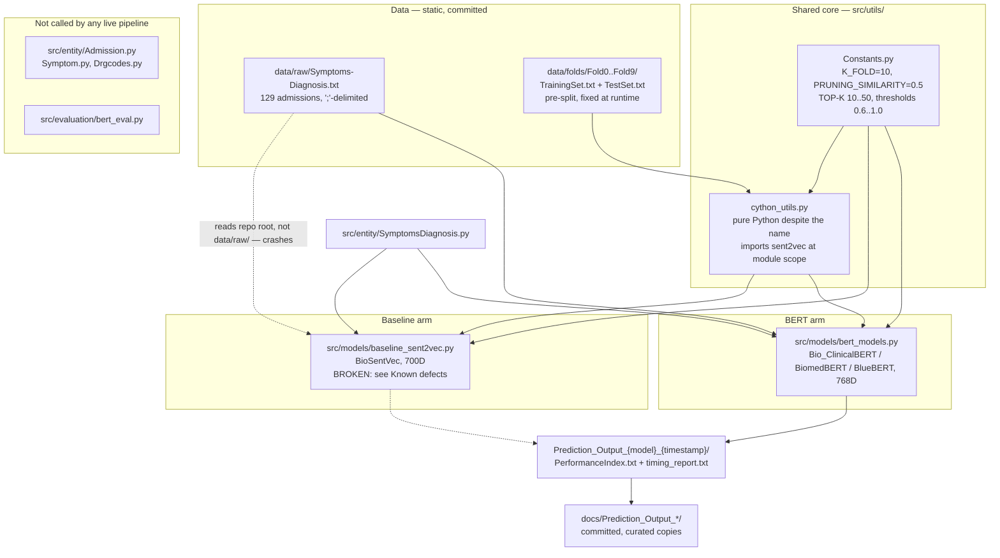

# Architecture

This supersedes the now-archived [`ARCHITECTURE.md`](../../archive/stale-docs/ARCHITECTURE.md), which says 128
admissions, labels `cython_utils.py` "Cython Utils" without noting it's actually pure Python,
and doesn't mention that the baseline arm currently crashes. Everything below was checked
against the code on 2026-08-04, not carried forward from that file. Where the two disagree,
this one is right.

**The one-sentence version:** two model arms (BioSentVec baseline, three BERT variants) share
a single pure-Python evaluation core (`src/utils/cython_utils.py`) so that embedding choice is
the only variable between them; the BERT arm runs end-to-end and its results are committed
under `docs/`, the baseline arm currently cannot run at all, and the "F1" in every result file
is mathematically forced to equal precision and recall — it collapses to plain accuracy.

## Layered structure

| Layer | Location | What it actually does | Status |
|---|---|---|---|
| Data | `data/raw/Symptoms-Diagnosis.txt` | 129 MIMIC-III admissions, `;`-delimited, one per line | static, committed |
| Data | `data/folds/Fold0..Fold9/{TrainingSet,TestSet}.txt` | Pre-computed 10-fold CV split of the same 129 records | static, committed — **not** regenerated at runtime |
| Config | `src/utils/Constants.py` | Fold count, similarity thresholds, TOP-K bounds, path autodetection | live, imported by everything |
| Shared core | `src/utils/cython_utils.py` | Preprocessing, cosine similarity, prediction (`predictS2V`), evaluation math | live, imported by both model arms — **pure Python**, see below |
| Entities | `src/entity/SymptomsDiagnosis.py` | The one record type actually used: HADM_ID, symptoms, preprocessed diagnosis list | live |
| Entities | `src/entity/{Admission,Symptom,Drgcodes}.py` | Field-index constants for raw MIMIC-III `ADMISSIONS`/`DRGCODES`-style tables | **orphaned**, no live callers |
| Model arm | `src/models/baseline_sent2vec.py` | BioSentVec (sent2vec) 700D embeddings, 10-fold CV, PDF timing report | **currently crashes**, see Known defects |
| Model arm | `src/models/bert_models.py` | Bio_ClinicalBERT / BiomedBERT / BlueBERT (sentence-transformers) 768D embeddings, 10-fold CV | live, this is what produced the committed results |
| Evaluation | `src/evaluation/bert_eval.py` | Alternative evaluator: raw `transformers.AutoModel` + manual mean-pooling instead of sentence-transformers | **orphaned**, zero callers, has its own bugs |
| Scripts | `scripts/run_baseline.py`, `run_bert_analysis.py`, `run_all_bert_models.py` | Thin CLI entry points that import and call the model-arm modules | live (BERT path), broken (baseline path) |
| Scripts | `scripts/analyze_performance.py`, `analyze_score_distributions.py`, `build_dashboard_data.py`, `build_readme_plots.py` | Post-hoc parsing/plotting of `PerformanceIndex.txt` outputs | mixed, see Known defects |
| Output | `Prediction_Output_{model}_{timestamp}/PerformanceIndex.txt` (+ `timing_report.txt`) | Per-admission, per-fold, and 10-fold-mean metric rows | curated copies committed at `docs/Prediction_Output_*/` |

## The central design constraint: one evaluation core, two embedding arms

The entire point of the reproduction is that BioSentVec and the three BERT models are
compared under identical conditions, with the embedding model as the only thing that changes.
That constraint lives in `src/utils/cython_utils.py`, which both `baseline_sent2vec.py` and
`bert_models.py` import for:

- `preprocess_sentence()` / `preprocess_diagnosis()` — identical text normalization for both arms
- `load_dataset()` — reads the static `data/folds/FoldN/{TrainingSet,TestSet}.txt` files
- `cosine_similarity()`, `get_diagnosis_similarity_by_description_max()` — the actual similarity math
- `init_confusion_matrix()`, `compute_performance_index()`, `compute_aggregated_performance_index()`, `print_performance_index()` — all metric bookkeeping

What is *not* shared: the actual candidate-ranking loop. The baseline arm calls
`util_cy.predictS2V()` directly. `bert_models.py` does not — it defines its own
`compute_patient_similarity_pairwise()` and `predict_topk_diagnoses_pure()`, explicitly
described in its own docstrings as "Pure Python prediction functions to replace
util_cy.predictS2V" and as matching "baseline cython_utils.py lines 59-88". So the two arms'
prediction loops are two independent implementations of the same algorithm, not one shared
function — the BERT arm's reimplementation is a second place the ranking logic could silently
drift from the baseline's, even though today it was written to mirror it line-for-line. The
parts that are genuinely one shared code path across both arms are preprocessing, fold
loading, diagnosis-level similarity (`get_diagnosis_similarity_by_description_max()`), and all
metric aggregation.

A few other things about this module that the name and the old docs get wrong or omit:

- **It is pure Python, not Cython.** The original compiled version (`util_cy.pyx` → `util_cy.c`
  via Cython 0.29.24) is archived at [`archive/cython_source/util_cy.c`](../../archive/cython_source/util_cy.c).
  The live `src/utils/cython_utils.py` is a from-scratch Python reimplementation — `cosine_similarity()`'s
  docstring says so directly ("Pure Python implementation replacing the Cython cdef function"). There is
  no build step, no `.pyx`, no `setup.py` extension — it's just a `.py` file with a name left over from
  the port.
- **It imports `sent2vec` at module scope** (`cython_utils.py:11`). Anything that imports this module —
  including `bert_models.py`, which has nothing to do with sent2vec — transitively requires the `sent2vec`
  package to be importable, even though `pyproject.toml` deliberately splits `bert` and `baseline` into
  separate optional-dependency groups specifically "so the BERT arm never requires it." In practice this
  works today only because `sent2vec` happens to be either installed or unnecessary for the paths actually
  exercised; `tests/test_bert_symptom_pairwise.py` works around it explicitly by inlining copies of the
  helper functions instead of importing `cython_utils` (see the comment at the top of that file).
- **`preprocess_sentence()` references a `stop_words` global that `cython_utils.py` never defines or
  imports.** Every current caller (`baseline_sent2vec.py`, `bert_models.py`, and the orphaned
  `bert_eval.py`) monkey-patches it in immediately after import — `util_cy.stop_words = set(stopwords.words('english'))`
  — as a workaround for what the source comments call "the missing initialization" from the original C code.
  Import `cython_utils` and call `preprocess_sentence()` without that line and it raises `NameError`.
- **Embedding dictionaries are keyed by preprocessed text, not `HADM_ID`.** `embending_symptoms()` and
  `embending_diagnosis()` (and their BERT-arm equivalents `compute_bert_symptom_embeddings()` /
  `compute_bert_diagnosis_embeddings()`) split each admission's `symptoms` string on commas, preprocess
  each fragment, and store one vector per unique symptom/diagnosis *string* — several admissions that share
  a symptom phrasing share one embedding. Every call site retrieves a vector as `emb[0]`
  (`cosine_similarity(test_emb[0], train_emb[0])` in `predictS2V`, and the same pattern in the BERT arm's
  pairwise functions). For the baseline, that `[0]` is unwrapping whatever per-call, indexable structure
  `sent2vec`'s `model.embed_sentence()` returns — `embending_symptoms()` stores it as-is, unmodified. The
  BERT arm gets the same `emb[0]` contract by construction instead: `SentenceTransformer.encode()` returns
  one flat vector per input in a batch, and `compute_bert_symptom_embeddings()` / `compute_bert_diagnosis_embeddings()`
  explicitly wrap each one in a one-element list (`embeddings[text] = [embedding]`) purely so the shared
  `[0]`-indexing call sites work unchanged.
- **Folds are static committed files, not computed at runtime.** `load_dataset(nFold, name)` just opens
  `data/folds/FoldN/{name}` — there is no `train_test_split` or `KFold` call anywhere in the live path
  (the `sklearn.model_selection` imports in both model files are unused leftovers). The 10-way split was
  produced once, upstream, and is fixed.

## Data flow, end to end

1. **Load admissions.** Each model-arm script reads `Symptoms-Diagnosis.txt`, splits every line on
   `;` into `SymptomsDiagnosis` objects, and preprocesses the diagnosis field at load time
   (`util_cy.preprocess_diagnosis`: lowercases, splits multi-DRG lines on `--`, strips `apr:`/`hcfa:`/`ms:`
   prefixes, dedupes, then re-attaches which DRG type(s) yielded each unique description).
2. **Load the embedding model.** `sent2vec.Sent2vecModel().load_model(...)` for the baseline, or
   `SentenceTransformer(model_path)` for one of the three BERT checkpoints.
3. **Embed.** Build `embeddings_symptoms` and `embeddings_diagnosis` dicts as described above — one
   pass over all 129 admissions, before any fold loop starts.
4. **For each of the 10 static folds:**
   - Load `TrainingSet.txt` / `TestSet.txt` via `load_dataset()`.
   - For every test admission, compute a symptom-level similarity against every training admission:
     for each test symptom, take the max cosine similarity to any train symptom, then average those
     maxima over `max(len(test_symptoms), len(train_symptoms))`. This produces one `similarity_matrix`
     row per test admission.
   - **MAX strategy:** pick the single highest-scoring training admission whose similarity clears
     `PRUNING_SIMILARITY` (0.5). If none clears it, that test case contributes nothing to any threshold
     bucket for MAX.
   - **TOP-K strategy** (K = 10, 20, 30, 40, 50): rank all training admissions by the same similarity,
     keep the top `TOP_K_UPPER_BOUND - TOP_K_INCR` (50) candidates that clear the same 0.5 pruning floor,
     then slice to the first K for each strategy.
   - For each retained candidate, compute **diagnosis-level** similarity separately:
     `get_diagnosis_similarity_by_description_max()` takes the max cosine similarity over the full
     Cartesian product of {ground-truth diagnosis descriptions} × {predicted diagnosis descriptions},
     using the diagnosis-embedding dict from step 3 (not the symptom one).
   - Classify each admission as TP/FP against five thresholds, `{1.0, 0.9, 0.8, 0.7, 0.6}`, by comparing
     that diagnosis similarity to each threshold.
   - Aggregate TP/FP into per-fold precision/recall/F-score/prediction-rate via
     `compute_aggregated_performance_index()`.
5. **Aggregate across folds.** `print_performance_index()` divides the 10 folds' summed TP/FP and
   averaged P/R/F/PR by `K_FOLD` (10) — a mean of 10 per-fold numbers, not a single micro-average over
   all 129 test cases at once. This is why, e.g., a "10-fold TP" of `12.9` appears in the committed
   output: it is `129 / 10`.
6. **Write output.** `PerformanceIndex.txt` (per-case rows, per-fold aggregates, final 10-fold means)
   and `timing_report.txt` land in a timestamped `Prediction_Output_{model}_{timestamp}/` directory
   under the current working directory. Three such directories, one per BERT model, are committed
   (copied) into `docs/Prediction_Output_*/`; the baseline arm has never produced one because it
   cannot currently run.



## Constants (`src/utils/Constants.py`)

| Name | Value | Meaning |
|---|---|---|
| `K_FOLD` | 10 | Number of CV folds; matches the 10 `data/folds/FoldN/` directories |
| `PRUNING_SIMILARITY` | 0.5 | Minimum symptom-level patient similarity for a training admission to be considered a candidate at all, for both MAX and TOP-K |
| `MIN_SIMILARITY` | 0 | Floor used to initialize max-tracking loops |
| `TOP_K_LOWER_BOUND` | 10 | First TOP-K strategy evaluated |
| `TOP_K_UPPER_BOUND` | 60 | Exclusive bound — combined with the increment below, produces K = 10, 20, 30, 40, 50 |
| `TOP_K_INCR` | 10 | Step between TOP-K strategies |
| classification thresholds | `{1.0, 0.9, 0.8, 0.7, 0.6}` | Diagnosis-similarity cutoffs for TP/FP; not a `Constants.py` name — declared as a literal `set` at each call site in `cython_utils.py` |
| `TRAIN` / `TEST` | `TrainingSet.txt` / `TestSet.txt` | Filenames within each `data/folds/FoldN/` directory |
| `CH_DIR` | `Path(__file__).parent.parent.parent` | Auto-detected repo root, used to build absolute paths |

Note the classification thresholds are stored and iterated as a Python `set`, not a sorted list — every
block in `PerformanceIndex.txt` reports them in the fixed-but-non-numeric order `0.9, 1.0, 0.6, 0.8, 0.7`,
which is just CPython's hash order for that literal, not a meaningful ordering.

## Output format and the P = R = F1 collapse

`PerformanceIndex.txt` is plain text: a `FOLD N: LEN train: X, LEN test: Y` header, then for each test
admission six blocks (`MAX`, `TOP-10` … `TOP-50`), each block a `TP FP P R FS PR` header followed by one
row per threshold. After all 10 folds, the same block structure repeats twice more: once aggregated per
fold, once as the final `10-FOLD PERFORMANCE INDEX` mean. Example, from
[`docs/Prediction_Output_Bio_ClinicalBERT_15022026_11-33-48/PerformanceIndex.txt`](../Prediction_Output_Bio_ClinicalBERT_15022026_11-33-48/PerformanceIndex.txt):

```
10-FOLD PERFORMANCE INDEX of MAX SIMILARITY by MAX
	 TP 	 FP 	  P 	 R 	 FS 	 PR
0.9	3.7	9.2	0.2852564102564103	0.2852564102564103	0.2852564102564103	1.0
1	1.9	11.0	0.14615384615384616	0.14615384615384616	0.14615384615384616	1.0
0.6	12.9	0.0	1.0	1.0	1.0	1.0
```

`12.9` is `129 / 10` — the golden confirmation that the dataset is 129 admissions, not 128.

Across all three committed result files (12,600 metric rows total), `P == R == F` exactly, and the
prediction rate (`PR`) column is `1.0` everywhere with zero exceptions. This is not a bug in the sense
of a coding mistake — it falls directly out of `compute_performance_index()`
(`cython_utils.py:373-398`):

```python
precision = tp / (tp + fp)
recall = tp / nrow
f_score = (2 * recall * precision) / (recall + precision)
prediction_rate = (tp + fp) / nrow
```

Every test case increments exactly one of `TP` or `FP` for MAX (`predictS2V`, `cython_utils.py:110-116`)
and for TOP-K whenever it has at least one candidate (`cython_utils.py:140-146`) — so `tp + fp == nrow`
holds *whenever every test case in the fold has at least one qualifying candidate*. That is exactly what
`prediction_rate == 1.0` means, and it holds in every observed row. Once `tp + fp == nrow`, `precision`
and `recall` are algebraically forced equal (`tp/nrow` either way), so `f_score` collapses to the same
value too: **the reported "F1" is precision, is recall, is `TP/nrow`, is plain accuracy — one degree of
freedom, not three.** Why prediction rate is always 1.0 (every admission always clears the 0.5 symptom
pruning floor) is a separate, related phenomenon: biomedical BERT embeddings are compact enough that mean
pairwise cosine similarity between *unrelated* diagnoses runs 0.72–0.93, and the MAX-over-Cartesian-product
diagnosis aggregator amplifies that further. See
[`docs/score_distribution_analysis/next_steps.md`](../score_distribution_analysis/next_steps.md) for the
measured distributions and candidate fixes.

## Known defects

1. **The baseline arm cannot run.** `src/models/baseline_sent2vec.py:236` reads
   `os.path.join(CH_DIR, "Symptoms-Diagnosis.txt")` — the repo root — but the file lives at
   `data/raw/Symptoms-Diagnosis.txt` (the BERT arm gets this right, at `bert_models.py:375`). This raises
   `FileNotFoundError` before anything else runs. Fixing only that uncovers a second bug immediately after:
   `baseline_sent2vec.py:244-247` calls `entity.SymptomsDiagnosis.SymptomsDiagnosis(...)`, but the file only
   ever imports `src.entity.SymptomsDiagnosis as entity_module` and
   `from src.entity.SymptomsDiagnosis import SymptomsDiagnosis` — the bare name `entity` is never bound,
   so this raises `NameError`. Fixing both of those still leaves `util_cy.load_model()`
   (`cython_utils.py:237-248`) loading the 22.5 GB BioSentVec `.bin` from `os.getcwd()`, not from
   `data/models/` as `data/models/README.md` claims it will. The published baseline numbers
   (TOP-10/20/30 F1 of 0.489/0.512/0.521 at threshold 0.6, quoted in the root `README.md`) came from the
   pre-reorganization `CS2V.py` and have not been reproduced by the current code.
2. **`scripts/build_readme_plots.py:30`** globs `Prediction_Output_*/PerformanceIndex.txt` against the
   repo root, but the three committed result directories live under `docs/`
   (`docs/Prediction_Output_Bio_ClinicalBERT_.../`, etc.). It raises `FileNotFoundError` with no matches
   as written. `scripts/analyze_performance.py:27-28` has the identical repo-root glob and fails the same
   way; `scripts/build_dashboard_data.py:172` was fixed to glob under `docs/` and works.

## Orphaned code

- **`src/evaluation/bert_eval.py`** (`BioClinicalBERTEvaluator`) has zero callers anywhere in `src/`,
  `scripts/`, or `tests/`. It implements its own embedding path — raw `transformers.AutoTokenizer` +
  `AutoModel` with manual mean-pooling over `last_hidden_state` (`get_bert_embedding()`,
  `bert_eval.py:132-149`) — which is a genuinely different pooling strategy from the
  `sentence_transformers.SentenceTransformer.encode()` used by the live `bert_models.py`, and could be
  worth salvaging for a future pooling-strategy ablation. As committed it does not run: `load_dataset()`
  (`bert_eval.py:121`) has the same unbound-`entity` `NameError` as `baseline_sent2vec.py`, and it also
  reads `Symptoms-Diagnosis.txt` from the repo root (`bert_eval.py:106`) instead of `data/raw/`.
- **`src/entity/Admission.py`, `Symptom.py`, `Drgcodes.py`** define field-index constants for raw
  MIMIC-III `ADMISSIONS`/`DRGCODES`-style tables that predate the `Symptoms-Diagnosis.txt` consolidation.
  They're imported by `src/entity/__init__.py` and exercised only by `tests/test_reorganization.py`, which
  checks that they still import — nothing in `src/models`, `src/evaluation`, or `scripts` constructs an
  instance of any of the three.

## What isn't here

No `Dockerfile`, no `.github/workflows`, and no RunPod or other cloud-deploy configuration exist anywhere
in the repository. The committed BERT results were produced on Apple Silicon (MPS) locally — see the
platform line in [`docs/bert_model_comparison.md`](../bert_model_comparison.md) and the libomp fix in
[`docs/guides/setup.md`](../guides/setup.md).
